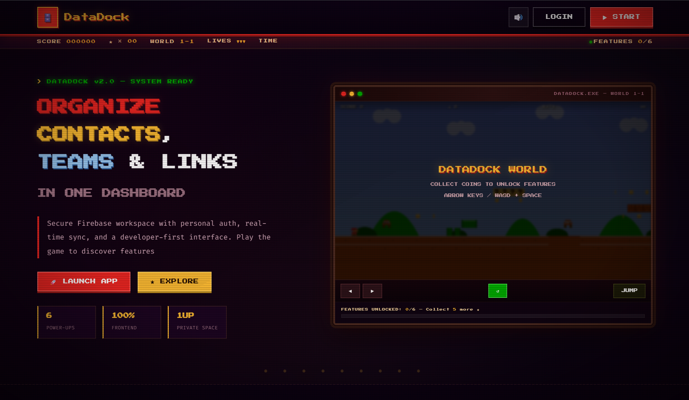
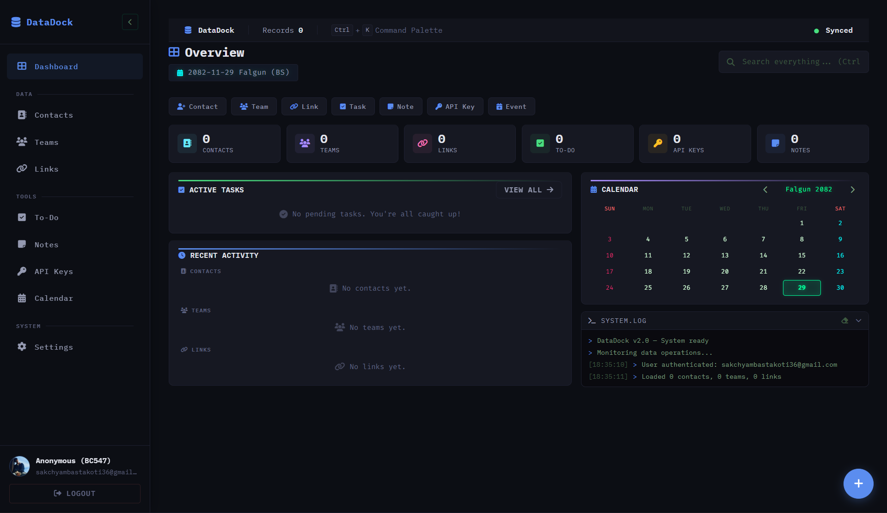

<div align="center">

# 🗄️ DataDock

**A secure, personal data management dashboard — powered by Firebase.**


> Store and manage your contacts, teams, links, notes, to-dos, API keys, and calendar events — all in one private, authenticated workspace with real-time sync.

</div>

---

## 📸 Screenshots

### Landing


### Dashboard


---

## 📖 Story Time

We started building DataDock because hackathons and events kept giving us the same painful problem: every time we had to apply, we were hunting for team member details, contacts, links, and credentials across different chats, notes, and old forms.

It became annoying to repeatedly fill forms, verify member information, and track developer essentials like API keys and to-do items in scattered places. So we created one centralized platform where we can manage everything in one secure workspace and move faster during competitions.

DataDock came to life from that exact need: less form chaos, better team coordination, and a cleaner workflow under pressure.

---

## ✨ Features

### 🔐 Authentication
- Email / password signup and login
- Google OAuth one-click login
- Automatic per-user workspace initialization in Firestore
- Protected routes — unauthenticated users redirected to login

### 📋 Data Modules
| Module | Description |
|---|---|
| **Contacts** | Full profiles — name, email, phone, GitHub, LinkedIn, role, notes |
| **Teams** | Groups with members, social links, contact numbers, and notes |
| **Links** | URL vault with title, URL, quick-copy, and notes |
| **To-Do** | Tasks with priority levels, due dates, and completion tracking |
| **API Keys** | Masked credential store for API keys and passwords |
| **Notes** | Rich text notes with tags and fullscreen Notepad-style editor |
| **Calendar** | Nepali BS calendar with event management and daily detail view |

### 🖥️ Dashboard
- Summary stat cards — click to navigate directly to each section
- Quick Actions bar — one-click add buttons for all 7 data types
- Unified recent activity feed (contacts, teams, links)
- Embedded mini-calendar widget
- Collapsible system terminal log console
- Global search across all data

### 📝 Fullscreen Note Editor
- **Notepad/VS Code-style** editor — opens full-screen on any device
- Line number gutter with current line highlight
- Live character count, line/column position indicator
- Unsaved changes indicator and discard confirmation guard
- **Markdown preview** — toggle between edit and rendered view
- **Keyboard shortcuts:** `Ctrl+S` save, `Ctrl+B` bold, `Ctrl+I` italic, `Esc` close, `Tab` indent
- Format toolbar: Bold, Italic, Code, Heading, Bullet List, Link
- Word wrap toggle
- Custom themed scrollbar

### 📜 Scrollable Data Lists
- All 6 data sections scroll independently within a capped viewport (75vh max)
- Custom-styled thin scrollbar matching the dark theme
- Bottom fade gradient hint when more content is below
- **Scroll-to-top button** — appears after scrolling 200px, smooth-scrolls back up
- **Item count badge** in each section header — updates live after every data change

### ⚙️ Core UX
- Command palette (`Ctrl+K`) for keyboard-driven navigation
- Quick-add floating action button (7 data types)
- Card and list view toggle per section
- JSON export (full workspace backup)
- JSON import with merge support
- Delete all data with confirmation
- Real-time Firestore sync via `onSnapshot`
- Local `localStorage` cache fallback
- Toast notifications and confirm modals
- Responsive sidebar — collapsible on desktop, drawer on mobile

### 🎨 Theme & Design
- Professional SaaS dark theme (inspired by Notion / Linear / Supabase)
- Grouped sidebar navigation (Data / Tools / System sections)
- 60/40 dashboard grid layout — priority content left, supporting widgets right
- Retro cyberpunk base with professional overlay
- IBM Plex Mono, Fira Code, Press Start 2P font stack
- Full keyboard accessibility with `:focus-visible` indicators

---

## 🗂️ Project Structure

```
Data_Dock/
├── index.html              # Landing page
├── auth.html               # Login / signup page
├── dashboard.html          # Main app dashboard
├── assets/
│   ├── css/
│   │   └── style.css       # Base styles (retro terminal + SaaS theme)
│   └── js/
│       ├── firebase-config.js  # Firebase app initialization
│       ├── auth.js             # Authentication logic
│       ├── storage.js          # Firestore CRUD helpers
│       └── script.js           # Dashboard UI and interactions
└── docs/
    ├── README.md           # Project documentation
    └── SECURITY.md         # Security policy
```

---

## 🛠️ Tech Stack

| Layer | Technology |
|---|---|
| Frontend | HTML5, CSS3, Vanilla JavaScript (ES Modules) |
| Authentication | Firebase Authentication (Email + Google OAuth) |
| Database | Cloud Firestore (NoSQL, real-time) |
| Fonts | IBM Plex Mono, Fira Code, Press Start 2P (Google Fonts) |
| Icons | Font Awesome 6.5.1 |
| Hosting | GitHub Pages (static) |

---

## 🚀 Getting Started

### Prerequisites

- A [Firebase](https://firebase.google.com) project with Authentication and Firestore enabled
- A local HTTP server (ES modules do not work with `file://` URLs)

---

### 1. Clone the Repository

```bash
git clone https://github.com/<your-username>/DataDock.git
cd DataDock
```

---

### 2. Configure Firebase

Open `assets/js/firebase-config.js` and replace the config values with your own from the [Firebase Console](https://console.firebase.google.com):

```js
const firebaseConfig = {
  apiKey:            "YOUR_API_KEY",
  authDomain:        "YOUR_PROJECT.firebaseapp.com",
  projectId:         "YOUR_PROJECT_ID",
  storageBucket:     "YOUR_PROJECT.appspot.com",
  messagingSenderId: "YOUR_SENDER_ID",
  appId:             "YOUR_APP_ID"
};
```

> **Note:** Firebase web API keys are safe to include in frontend code. Security is enforced via Firestore Rules and Authentication, not by keeping the key secret. Optionally restrict the key by HTTP referrer in the [Google Cloud Console](https://console.cloud.google.com).

### 2.1 Public Repository Safety Checklist

Before making this repository public:

1. Keep `assets/js/firebase-config.js` on placeholder values in Git.
2. If real Firebase values were ever committed, **rotate the API key** in Google Cloud Console and regenerate credentials as needed.
3. Restrict the Firebase Browser API key by HTTP referrer (your production domains only).
4. Verify Firestore Security Rules are locked to authenticated user scope.

> If secrets were committed previously, rewriting Git history is recommended before publishing (`git filter-repo` or BFG Repo-Cleaner), then force-push the cleaned history.

---

### 3. Enable Firebase Services

**Authentication** → Firebase Console → Authentication → Sign-in method:
- ✅ Email/Password
- ✅ Google

**Firestore** → Firebase Console → Firestore Database:
- Click **Create database**
- Choose your preferred region
- Start in **production mode**

---

### 4. Apply Firestore Security Rules

In Firebase Console → Firestore → **Rules**, paste:

```
rules_version = '2';
service cloud.firestore {
  match /databases/{database}/documents {
    match /users/{userId} {
      allow read, write: if request.auth != null
                         && request.auth.uid == userId;
    }
  }
}
```

This enforces strict per-user data isolation — no user can read or write another user's data.

---

### 5. Run Locally

**Option A — VS Code Live Server**
1. Install the [Live Server](https://marketplace.visualstudio.com/items?itemName=ritwickdey.LiveServer) extension
2. Right-click `index.html` → **Open with Live Server**

**Option B — Python**
```bash
python -m http.server 5500
```
Then open `http://localhost:5500`

**Option C — Node.js**
```bash
npx serve .
```

---

## ☁️ Deployment

### GitHub Pages

1. Push the project to a GitHub repository
2. Go to **Settings → Pages**
3. Under **Build and deployment**, set:
   - Source: `Deploy from a branch`
   - Branch: `main`, directory: `/ (root)`
4. Save — GitHub will build and deploy automatically
5. Your app will be live at:

```
https://<your-username>.github.io/<repository-name>/
```

### Netlify (Recommended)

For a faster, more reliable deployment with automatic SSL and preview deploys, see the full guide:

📄 **[DEPLOY\_NETLIFY.md](DEPLOY_NETLIFY.md)** — covers Netlify setup, Google Authentication configuration, authorized domain setup, API key restrictions, and troubleshooting.

---

## 🗃️ Data Model

All user data lives in a single Firestore document under `users/{uid}`:

```
users/
  {uid}/
    contacts:       Contact[]
    teams:          Team[]
    links:          Link[]
    todos:          Todo[]
    apikeys:        ApiKey[]
    notes:          Note[]
    calendarEvents: CalendarEvent[]
```

### Contact
```json
{
  "name":     "Full Name",
  "email":    "user@example.com",
  "phone":    "9800000000",
  "github":   "github.com/username",
  "linkedin": "linkedin.com/in/username",
  "role":     "Developer",
  "notes":    "Additional notes"
}
```

### Team
```json
{
  "teamName": "Team Alpha",
  "phone":    "9800000000",
  "socials":  [{ "platform": "GitHub", "url": "github.com/team" }],
  "members":  [{ "name": "Alice", "role": "Lead", "email": "alice@example.com" }],
  "notes":    "Project context"
}
```

### Link
```json
{
  "title": "GitHub",
  "url":   "https://github.com/username",
  "notes": "Personal profile"
}
```

### Todo
```json
{
  "text":      "Finish deployment",
  "priority":  "high",
  "due":       "2026-03-15",
  "completed": false
}
```

### API Key
```json
{
  "label":    "GitHub Token",
  "value":    "ghp_XXXXXXXXXX",
  "category": "API",
  "notes":    "Personal access token"
}
```

### Note
```json
{
  "title":     "Project Ideas",
  "body":      "Supports **bold**, *italic*, `code`, ## Headings, - Lists",
  "tag":       "work",
  "createdAt": "2026-03-12T00:00:00.000Z"
}
```

### Calendar Event
```json
{
  "title":  "Sprint Review",
  "bsDate": "2082-12-01",
  "color":  "green",
  "notes":  "Q4 sprint review meeting"
}
```

---

## 📝 Note Editor

The note editor opens as a fullscreen overlay, replacing the small modal for a proper writing experience.

| Feature | Detail |
|---|---|
| Line numbers | Gutter auto-updates with active line highlighted |
| Character/position | Live `Ln X, Col Y` and character count in title bar |
| Unsaved indicator | Yellow dot appears on any change; prompts before discard |
| Markdown preview | Toggle renders `**bold**`, `*italic*`, `` `code` ``, `## headings`, `- lists` |
| Format toolbar | Bold, Italic, Code, Heading, Bullet List, Link buttons |
| Keyboard shortcuts | `Ctrl+S` save · `Ctrl+B` bold · `Ctrl+I` italic · `Esc` close · `Tab` indent |
| Word wrap | Toggle button to switch between wrapped and horizontal-scroll mode |

---

## 🔄 Import / Export

### Export
- Click **Settings → Export All Data (JSON)**
- Downloads a `.json` file containing all contacts, teams, links, todos, API keys, notes, and events

### Import
- Click **Settings → Import Data (JSON)**
- Accepts a previously exported `.json` file
- **Merge behavior** — imported items are appended; existing data is preserved
- The shape of the JSON is validated before importing

---

## 🧩 Module Architecture

### `firebase-config.js`
- Initializes the Firebase app
- Exports `auth`, `db`, and `googleProvider`

### `auth.js`
- Handles login, signup, and Google OAuth flows
- Redirects authenticated users to `dashboard.html`
- Redirects unauthenticated users to `auth.html`

### `storage.js`
- All Firestore read/write operations
- `loadUserData(uid)` — loads or initializes workspace
- `save*` functions — update individual collections
- `subscribeToUserData(uid, callback)` — real-time listener
- `importData(uid, data)` — merge import
- `deleteAllData(uid)` — reset workspace

### `script.js`
- Dashboard UI rendering for all 7 modules
- Fullscreen note editor (open, save, close, preview, formatting)
- Scrollable list containers with scroll-to-top and item count badges
- Modal and form lifecycle
- Section navigation and search filtering
- Clipboard copy actions
- Command palette implementation (`Ctrl+K`)
- Quick Actions chips and FAB menu
- Export/import trigger handlers
- Nepali BS calendar logic with BS↔AD conversion

---

## ⌨️ Keyboard Shortcuts

| Shortcut | Action |
|---|---|
| `Ctrl + K` | Open command palette |
| `Ctrl + N` | Open quick-add FAB menu |
| `Ctrl + S` | Save note (inside note editor) |
| `Ctrl + B` | Bold text (inside note editor) |
| `Ctrl + I` | Italic text (inside note editor) |
| `Esc` | Close note editor / close modal |
| `Tab` | Insert 4-space indent (inside note editor) |

---

## 🐛 Troubleshooting

| Problem | Solution |
|---|---|
| Blank page / module errors | Run through a local HTTP server, not `file://` |
| Login works but data fails to load | Check Firestore security rules and `projectId` |
| Google login popup blocked | Allow popups for your domain; check Firebase authorized domains |
| GitHub Pages shows 404 | Verify all asset paths are relative (`assets/css/style.css` not `/style.css`) |
| Import fails silently | Ensure the JSON file matches the expected shape |
| Auth redirect loop | Clear browser `localStorage` and cookies, then reload |
| Note editor doesn't open | Ensure JavaScript is enabled and there are no console errors |

---

## 🔮 Roadmap

- [ ] Type-to-confirm on "Delete All Data"
- [ ] Duplicate detection during JSON import
- [ ] Drag-and-drop item reordering
- [ ] PWA support with offline cache
- [ ] Dark / light theme toggle
- [ ] Contact / team tagging and filtering
- [ ] Split-pane note editor (edit + preview side by side)
- [ ] Note export to `.md` / `.txt`

---

## 🔒 Security

- Firestore rules strictly isolate each user's data by `uid`
- Firebase web API keys are intentionally public — restrict by HTTP referrer for production
- No admin SDK or service account keys are used or committed
- All user inputs are HTML-escaped before rendering to prevent XSS
- API key values are masked by default; reveal requires explicit user action
- See [SECURITY.md](SECURITY.md) for the vulnerability reporting policy

---

## 📄 License

This project is licensed under the **MIT License**.
You are free to use, modify, and distribute it with attribution.

---

## 🙏 Acknowledgments

| Resource | Purpose |
|---|---|
| [Firebase](https://firebase.google.com) | Authentication & Firestore database |
| [Font Awesome](https://fontawesome.com) | Icons throughout the UI |
| [Google Fonts](https://fonts.google.com) | IBM Plex Mono, Fira Code, Press Start 2P |
| [GitHub Pages](https://pages.github.com) | Free static hosting |

---

<div align="center">

Built with passion and a lot of late nights.

**[index.html](../index.html) · [auth.html](../auth.html) · [dashboard.html](../dashboard.html)**

</div>


---

## ✨ Features

### 🔐 Authentication
- Email / password signup and login
- Google OAuth one-click login
- Automatic per-user workspace initialization in Firestore
- Protected routes — unauthenticated users redirected to login

### 📋 Data Modules
| Module | Description |
|---|---|
| **Contacts** | Full profiles — name, email, phone, GitHub, LinkedIn, role, notes |
| **Teams** | Groups with members, social links, contact numbers, and notes |
| **Links** | URL vault with title, URL, quick-copy, and notes |
| **To-Do** | Tasks with priority levels, due dates, and completion tracking |
| **API Keys** | Masked credential store for API keys and passwords |
| **Notes** | Rich text notes with tags, bold/italic/code formatting |
| **Calendar** | Nepali BS calendar with event management and daily detail view |

### 🖥️ Dashboard
- Summary stat cards per module
- Recent items panels (contacts, teams, links)
- Embedded mini-calendar widget
- System terminal log console
- Global search across all data

### ⚙️ Core UX
- Command palette (`Ctrl + K`) for keyboard-driven navigation
- Quick-add floating action button
- Card and list view toggle per section
- JSON export (full workspace backup)
- JSON import with merge support
- Delete all data with confirmation
- Real-time Firestore sync via `onSnapshot`
- Local `localStorage` cache fallback
- Toast notifications and confirm modals
- Responsive sidebar — collapsible on desktop, drawer on mobile

### 🎨 Theme
- Mario terminal aesthetic — Press Start 2P pixel font, NES color palette, CRT scanlines
- Fully interactive Mario platformer game embedded in the landing hero
- Retro cyberpunk dark palette for the dashboard

---

## 🗂️ Project Structure

```
Data_Dock/
├── index.html              # Original landing page
├── landing.html            # Mario-themed landing page with game
├── auth.html               # Login / signup page
├── dashboard.html          # Main app dashboard
├── assets/
│   ├── css/
│   │   ├── style.css       # Shared styles (retro terminal theme)
│   │   └── style.css.bak   # Style backup
│   └── js/
│       ├── firebase-config.js  # Firebase app initialization
│       ├── auth.js             # Authentication logic
│       ├── storage.js          # Firestore CRUD helpers
│       └── script.js           # Dashboard UI and interactions
└── docs/
    ├── README.md           # Project documentation
    └── SECURITY.md         # Security policy
```

---

## 🛠️ Tech Stack

| Layer | Technology |
|---|---|
| Frontend | HTML5, CSS3, Vanilla JavaScript (ES Modules) |
| Authentication | Firebase Authentication (Email + Google OAuth) |
| Database | Cloud Firestore (NoSQL, real-time) |
| Fonts | Press Start 2P, Fira Code, IBM Plex Mono (Google Fonts) |
| Icons | Font Awesome 6 |
| Hosting | GitHub Pages (static) |

---

## 🚀 Getting Started

### Prerequisites

- A [Firebase](https://firebase.google.com) project with Authentication and Firestore enabled
- A local HTTP server (ES modules do not work with `file://` URLs)

---

### 1. Clone the Repository

```bash
git clone https://github.com/<your-username>/DataDock.git
cd DataDock
```

---

### 2. Configure Firebase

Open `assets/js/firebase-config.js` and replace the config values with your own from the [Firebase Console](https://console.firebase.google.com):

```js
const firebaseConfig = {
  apiKey:            "YOUR_API_KEY",
  authDomain:        "YOUR_PROJECT.firebaseapp.com",
  projectId:         "YOUR_PROJECT_ID",
  storageBucket:     "YOUR_PROJECT.appspot.com",
  messagingSenderId: "YOUR_SENDER_ID",
  appId:             "YOUR_APP_ID"
};
```

> **Note:** Firebase web API keys are safe to include in frontend code. Security is enforced via Firestore Rules and Authentication, not by keeping the key secret. Optionally restrict the key by HTTP referrer in [Google Cloud Console](https://console.cloud.google.com).

---

### 3. Enable Firebase Services

**Authentication** → Firebase Console → Authentication → Sign-in method:
- ✅ Email/Password
- ✅ Google

**Firestore** → Firebase Console → Firestore Database:
- Click **Create database**
- Choose your preferred region
- Start in **production mode**

---

### 4. Apply Firestore Security Rules

In Firebase Console → Firestore → **Rules**, paste:

```
rules_version = '2';
service cloud.firestore {
  match /databases/{database}/documents {
    match /users/{userId} {
      allow read, write: if request.auth != null
                         && request.auth.uid == userId;
    }
  }
}
```

This enforces strict per-user data isolation — no user can read or write another user's data.

---

### 5. Run Locally

**Option A — VS Code Live Server**
1. Install the [Live Server](https://marketplace.visualstudio.com/items?itemName=ritwickdey.LiveServer) extension
2. Right-click `landing.html` → **Open with Live Server**

**Option B — Python**
```bash
python -m http.server 5500
```
Then open `http://localhost:5500/landing.html`

**Option C — Node.js**
```bash
npx serve .
```

---

## ☁️ Deployment (GitHub Pages)

1. Push the project to a GitHub repository
2. Go to **Settings → Pages**
3. Under **Build and deployment**, set:
   - Source: `Deploy from a branch`
   - Branch: `main`, directory: `/ (root)`
4. Save — GitHub will build and deploy automatically
5. Your app will be live at:

```
https://<your-username>.github.io/<repository-name>/landing.html
```

> Set `landing.html` as your default page, or rename it to `index.html` if you do not need the original `index.html`.

---

## 🗃️ Data Model

All user data lives in a single Firestore document under `users/{uid}`:

```
users/
  {uid}/
    contacts:       Contact[]
    teams:          Team[]
    links:          Link[]
    todos:          Todo[]
    apikeys:        ApiKey[]
    notes:          Note[]
    calendarEvents: CalendarEvent[]
```

### Contact
```json
{
  "name":     "Full Name",
  "email":    "user@example.com",
  "phone":    "9800000000",
  "github":   "github.com/username",
  "linkedin": "linkedin.com/in/username",
  "role":     "Developer",
  "notes":    "Additional notes"
}
```

### Team
```json
{
  "teamName": "Team Alpha",
  "phone":    "9800000000",
  "socials":  [{ "platform": "GitHub", "url": "github.com/team" }],
  "members":  [{ "name": "Alice", "role": "Lead", "email": "alice@example.com" }],
  "notes":    "Project context"
}
```

### Link
```json
{
  "title": "GitHub",
  "url":   "https://github.com/username",
  "notes": "Personal profile"
}
```

### Todo
```json
{
  "text":      "Finish deployment",
  "priority":  "high",
  "due":       "2026-03-15",
  "completed": false
}
```

### API Key
```json
{
  "label":    "GitHub Token",
  "value":    "ghp_XXXXXXXXXX",
  "category": "API",
  "notes":    "Personal access token"
}
```

### Note
```json
{
  "title": "Project Ideas",
  "body":  "Supports **bold**, *italic*, `code`",
  "tag":   "work"
}
```

### Calendar Event
```json
{
  "title":  "Sprint Review",
  "bsDate": "2082-12-01",
  "color":  "green",
  "notes":  "Q4 sprint review meeting"
}
```

---

## 🔄 Import / Export

### Export
- Click **Settings → Export All Data (JSON)**
- Downloads a `.json` file containing all contacts, teams, links, todos, API keys, notes, and events

### Import
- Click **Settings → Import Data (JSON)**
- Accepts a previously exported `.json` file
- **Merge behavior** — imported items are appended; existing data is preserved
- The shape of the JSON is validated before importing

---

## 🧩 Module Architecture

### `firebase-config.js`
- Initializes the Firebase app
- Exports `auth`, `db`, and `googleProvider`

### `auth.js`
- Handles login, signup, and Google OAuth flows
- Redirects authenticated users to `dashboard.html`
- Redirects unauthenticated users to `auth.html`

### `storage.js`
- All Firestore read/write operations
- `loadUserData(uid)` — loads or initializes workspace
- `save*` functions — update individual collections
- `subscribeToUserData(uid, callback)` — real-time listener
- `importData(uid, data)` — merge import
- `deleteAllData(uid)` — reset workspace

### `script.js`
- Dashboard UI rendering for all modules
- Modal and form lifecycle
- Section navigation and search filtering
- Clipboard copy actions
- Command palette implementation
- Export/import trigger handlers
- Nepali BS calendar logic

---

## 🐛 Troubleshooting

| Problem | Solution |
|---|---|
| Blank page / module errors | Run through a local HTTP server, not `file://` |
| Login works but data fails to load | Check Firestore security rules and `projectId` |
| Google login popup blocked | Allow popups for your domain; check Firebase authorized domains |
| GitHub Pages shows 404 | Verify all asset paths are relative (`assets/css/style.css` not `/style.css`) |
| Import fails silently | Ensure the JSON file matches the expected shape |
| Auth redirect loop | Clear browser `localStorage` and cookies, then reload |

---

## 🔮 Roadmap

- [ ] Type-to-confirm on "Delete All Data"
- [ ] Duplicate detection during JSON import
- [ ] Drag-and-drop item reordering
- [ ] PWA support with offline cache
- [ ] Dark / light theme toggle
- [ ] Contact / team tagging and filtering
- [ ] Note markdown preview mode

---

## 🔒 Security

- Firestore rules strictly isolate each user's data by `uid`
- Firebase web API keys are intentionally public — restrict by HTTP referrer for production
- No admin SDK or service account keys are used or committed
- All user inputs are sanitized before rendering to prevent XSS
- See [SECURITY.md](SECURITY.md) for the vulnerability reporting policy

---

## 📄 License

This project is licensed under the **MIT License**.
You are free to use, modify, and distribute it with attribution.

---

## 🙏 Acknowledgments

| Resource | Purpose |
|---|---|
| [Firebase](https://firebase.google.com) | Authentication & Firestore database |
| [Font Awesome](https://fontawesome.com) | Icons throughout the UI |
| [Google Fonts](https://fonts.google.com) | Press Start 2P, Fira Code, IBM Plex Mono |
| [GitHub Pages](https://pages.github.com) | Free static hosting |

---

<div align="center">

Built with passion and need  
come one if you came to the last buy me a coffe plz!!!

**[landing.html](../landing.html) · [auth.html](../auth.html) · [dashboard.html](../dashboard.html)**

</div>

